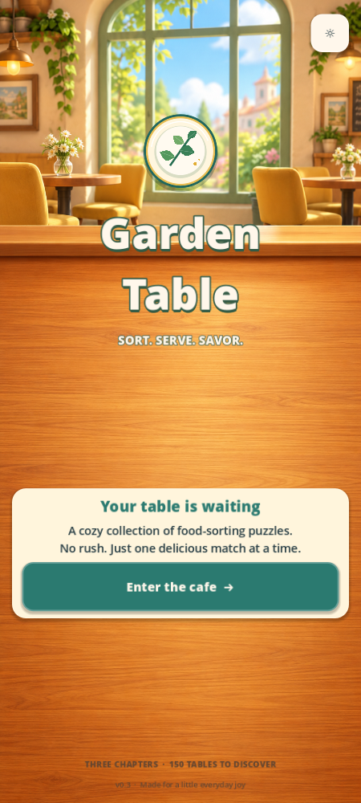
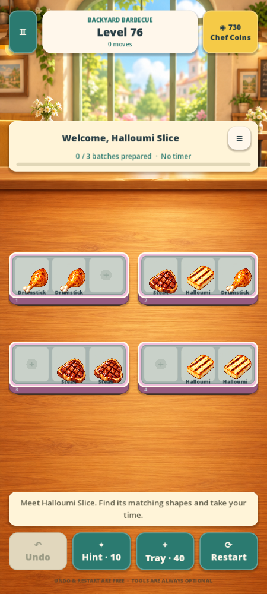
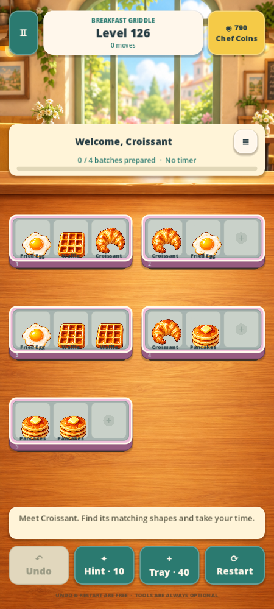

# Garden Table

A cozy, original food sorting puzzle made in **Godot 4.7.2 stable** (standard GDScript edition). Arrange three identical foods on a tray, uncover the next row, and prepare garden recipes. The game is offline and untimed.

Version **0.3 — A Bigger Table** contains **150 levels, 18 foods, and 12 recipe bundles**. This update adds 120 boards and two new food palettes, while keeping the original 30 levels and existing saves compatible. It retains the splash/title flow, main menu, three interactive Cooking School lessons, smooth animations, and Chef Coins for optional helpers and permanent tray finishes.

| Chapter | Levels | Foods |
| --- | --- | --- |
| Garden Grill | 1–50 | Tomato, corn, mushroom, pepper, zucchini, eggplant |
| Backyard Barbecue | 51–100 | Chicken drumstick, steak, prawn, fish fillet, sausage spiral, halloumi |
| Breakfast Griddle | 101–150 | Fried egg, pancake stack, waffle, toast, hash brown, croissant |

Each chapter has its own map page and illustrated ingredient/recipe collection. New foods arrive gradually; any single board uses at most six food types. The expanded campaign uses the current sorting and recipe rules. Sealed/chilled trays and the 600-level roadmap remain future work.

  

[Chapter map](docs/screenshots/chapter-map.png) · [Ingredient collection](docs/screenshots/ingredients.png) · [All 18 foods at gameplay scale](docs/screenshots/food-readability.png) · [Cooking School preview](docs/screenshots/cooking-school.png) · [Coin shop preview](docs/screenshots/coin-shop.png) · [Extra tray preview](docs/screenshots/extra-tray.png)

## Open and play

1. Download or clone this repository.
2. Install [Godot 4.7.2 standard](https://godotengine.org/download/archive/4.7.2-stable/).
3. In Godot's project manager, choose **Import**, select **project.godot**, and open the project. Let the textures/audio import.
4. Press **F5**. The splash leads to the title screen. Choose **Enter the cafe**, then **Start cooking** for three guided lessons, or choose a level from the map.

No plugin, package manager, account, API key, or Android SDK is needed to play in the desktop editor. The main scene is `scenes/main.tscn`. The Compatibility renderer is configured for the 2D project. The tested engine identifies as `4.7.2.stable.official.ed1daf0bf`.

### Controls and rules

- **Tap/click** a food, then an empty slot on another tray. Or **drag and release** over an empty slot.
- Occupied destinations never swap food. A move to the same tray is rejected without a penalty.
- Three identical foods on one active tray clear together and make **one batch**.
- A tray reveals its next queued row only when **all three** active positions are empty. Moving the last food away also reveals a row.
- Recipe orders count completed batches. Future tickets retain prepared ingredients; each batch is allocated once. Clear the entire board as well as the orders to win.
- **Undo** restores the whole previous transaction, including cascades, queues and orders. Up to 40 snapshots are retained.
- **Hint** costs 10 Chef Coins only when it finds a verified solution. Rechecking the same board during the same attempt is free. If search cannot prove a solution, no coins are spent.
- **Tray** adds one empty tray for 40 coins. It stays through undo and Continue; restarting begins a new attempt. Every level is still solvable without helpers.
- The **≡** beside the level title shows the full queued rows. **Restart** asks before discarding the current board.
- **Pause** or **Escape** opens the pause menu. Home → Continue resumes the saved table.

Settings include independent music and sound, optional Android haptics, reduced motion and food-name labels. Cooking School can be replayed from the main menu or settings without replacing a campaign save. School guidance, undo and restart are free. Menus ease in, buttons respond with a small spring, food arcs into place, matches sparkle and earned coins celebrate briefly; reduced motion removes movement while retaining clear feedback.

Choose a chapter from the level map or recipe book. The **Ingredients** tab shows all 18 food portraits and when they join your table. Clearing levels 50 and 100 opens the next chapter without a coin cost. Choosing your current unfinished level resumes it.

Chef Coins are earned with a one-time 100-coin welcome gift, 30 coins per first campaign clear, and a one-time 30-coin graduation gift. Spend them on hints, an extra tray, or permanent Sage/Berry tray finishes. The shop previews coin packs, but real-money purchases and ads are **not connected yet**. Existing 0.1 and 0.2 profiles keep their coins, collected finishes, saved board, undo history, and paid helpers. Players who finished the original 30 levels gain access to level 31. See [economy rules and future integration](docs/ECONOMY.md).

## What is verified

The project includes executable tests and machine-readable solution certificates. Run all checks with:

```bash
GODOT_BIN=/path/to/Godot_v4.7.2-stable_linux.x86_64 bash tools/run_checks.sh
```

The runner uses an isolated save directory, imports the project, checks Godot's error output as well as process status, runs every `tests/*_tests.gd` suite, and launches the main scene.

- Rule tests cover both Appendix E replays, prepared future ticket credits, deterministic cascades, whole-row reveals, invalid moves, token conservation, undo, typed data and strict validation.
- Every one of the 150 frozen levels has a stored no-tool winning replay, stable-state hashes and a content hash. All recorded moves are replayed and undone in the content tests. Structural checks reject boards that merely rename foods or rearrange the same trays. The original 30 level files and certificates are protected by a compatibility manifest.
- Save and economy tests cover old-profile migration, checksum/backup recovery, content mismatch, once-only rewards, transactional spending, repeat hint receipts, persistent extra trays, theme ownership and audio preferences.
- Scene integration tests feed actual Godot mouse and touch events, including multiple fingers, canceled drags, paused gestures, scaled pointer coordinates, reload, hints and layout bounds.
- An **Android debug APK was exported and its signature/manifest verified**. A physical phone and listening session are still needed to assess real touch comfort, audio mixing, safe areas, Android lifecycle behavior and sustained performance. Machine solution proofs do not substitute for human pacing/playtesting.

See [content expansion QA](docs/CONTENT_QA.md), [front-end/economy QA](docs/EXPANSION_QA.md), [original QA notes](docs/QA.md), [Cooking School](docs/TUTORIAL.md), [level authoring](docs/LEVELS.md), and [Android export instructions](docs/ANDROID.md).

## Project structure

| Path | Purpose |
| --- | --- |
| `core/` | Pure deterministic model, strict validator, bounded solver, typed Resources |
| `data/levels/` | 150 frozen level definitions and replay certificates |
| `data/foods/`, `data/recipes/` | Food art definitions and recipe data |
| `data/tuning/default.tres` | Inspector-editable timings, input and recovery settings |
| `scenes/main.gd` | Screen flow, stable-session presentation and pointer routing |
| `scenes/board/` | Reusable tray/board/food views; no independent match logic |
| `scenes/ui/` | Menus, chapter map, illustrated collection, styling and animation |
| `services/` | Recoverable persistence and original audio playback |
| `assets/` | Original generated art, synthesized audio and licensed Open Sans fonts |
| `tests/` | Deterministic rule/content/save/input regression suites |
| `tools/` | Offline level authoring/certification, tests and Linux environment setup |

The model completes a command and commits the stable save before playing its visual effects. Animation callbacks never decide matches or rewards. All play uses frozen level data; a large generator never runs on the phone. The authored definitions are converted into explicit Resource classes and copied for runtime state.

To add a food, create a `FoodDefinition` `.tres` with its texture and stable ID, then add an entry to `data/foods/catalog.json` with its first `unlock_level` and an optional short `slot_label` for compact tray labels. The resolver, validator, save service and food views use this shared registry. Level and recipe inventory must still pass the validator and receive a new verified solution certificate.

Saved progress is under Godot's `user://` folder for **Garden Table**. In the editor, **Project → Open User Data Folder** opens it. Main, temporary and backup saves are checksummed and validated together. Resetting progress requires a separate confirmation. Engine upgrades should be followed by a complete test and export pass.

## Art and scope

The food and restaurant artwork were generated for this project in the rounded, warmly lit style of the supplied references. The original reference sprites, interface assets and level layouts were not extracted. [Asset provenance](assets/ASSET_MANIFEST.md) and font/audio licenses are included.

Chapters 4–12, sealed/chilled/category trays, Rush, rearrange tools, cloud sync, ads, real-money purchases, localization beyond English, and Play Store release signing remain future work. Unsupported gameplay flags are rejected by the validator. The shipped English UI is translatable through Godot's translation APIs; reviewed translations and device testing are still future work.

For cloud development, use the existing checkout; each task already has an isolated environment. Run `bash tools/setup_environment.sh` to provision the pinned editor on Linux, or add `--android` for matching export templates and SDK tools. The helper verifies official artifact checksums and writes tools outside the repository. See the generated `environment.sh` and [Android documentation](docs/ANDROID.md).
