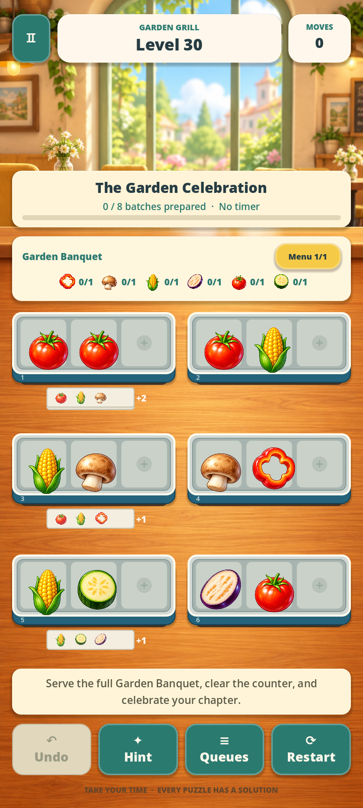

# Garden Table

A cozy, original food sorting puzzle made in **Godot 4.7.2 stable** (standard GDScript edition). Arrange three identical foods on a tray, uncover the next row, and prepare garden recipes. The game is offline and untimed.

This delivery is the development brief's **30-level Garden Grill vertical slice**: six illustrated foods, four recipe bundles, an original restaurant setting, music, sound effects, saved progress and a complete playable interface. The 150-level launch and 600-level expansion are future content stages.



## Open and play

1. Download or clone this repository.
2. Install [Godot 4.7.2 standard](https://godotengine.org/download/archive/4.7.2-stable/).
3. In Godot's project manager, choose **Import**, select **project.godot**, and open the project. Let the textures/audio import.
4. Press **F5**. A fresh profile starts in the one-move tutorial.

No plugin, package manager, account, API key, or Android SDK is needed to play in the desktop editor. The main scene is `scenes/main.tscn`. The Compatibility renderer is configured for the 2D project. The tested engine identifies as `4.7.2.stable.official.ed1daf0bf`.

### Controls and rules

- **Tap/click** a food, then an empty slot on another tray. Or **drag and release** over an empty slot.
- Occupied destinations never swap food. A move to the same tray is rejected without a penalty.
- Three identical foods on one active tray clear together and make **one batch**.
- A tray reveals its next queued row only when **all three** active positions are empty. Moving the last food away also reveals a row.
- Recipe orders count completed batches. Future tickets retain prepared ingredients; each batch is allocated once. Clear the entire board as well as the orders to win.
- **Undo** restores the whole previous transaction, including cascades, queues and orders. Up to 40 snapshots are retained.
- **Hint** highlights a move from a verified complete solution. If a bounded search cannot prove a solution, it says so and suggests undo/restart.
- **Queues** shows the full remaining rows. **Restart** asks before discarding the current board.
- **Pause** or **Escape** opens the pause menu. Home → Continue resumes the saved table.

Settings include independent music and sound, optional Android haptics, reduced motion and food-name labels. The level map supports replay of unlocked levels. First completion earns 30 cosmetic coins; replaying does not duplicate rewards. There are no purchases or advertisements.

## What is verified

The project includes executable tests and machine-readable solution certificates. Run all checks with:

```bash
GODOT_BIN=/path/to/Godot_v4.7.2-stable_linux.x86_64 bash tools/run_checks.sh
```

The runner uses an isolated save directory, imports the project, checks Godot's error output as well as process status, runs every `tests/*_tests.gd` suite, and launches the main scene.

- Rule tests cover both Appendix E replays, prepared future ticket credits, deterministic cascades, whole-row reveals, invalid moves, token conservation, undo, typed data and strict validation.
- Every one of the 30 frozen levels has a stored no-tool winning replay, stable-state hashes and a content hash. All 225 recorded moves are replayed; every move is also undone and replayed in the content tests.
- Save tests cover checksum verification, temporary/backup recovery, content mismatch, once-only rewards, board/queue/order history and audio preferences.
- Scene integration tests feed actual Godot mouse and touch events, including multiple fingers, canceled drags, paused gestures, scaled pointer coordinates, reload, hints and layout bounds.
- An **Android debug APK was exported and its signature/manifest verified**. A physical phone and listening session are still needed to assess real touch comfort, audio mixing, safe areas, Android lifecycle behavior and sustained performance. Machine solution proofs do not substitute for human pacing/playtesting.

See [QA notes](docs/QA.md), [level authoring and replay reports](docs/LEVELS.md), and [Android export instructions](docs/ANDROID.md).

## Project structure

| Path | Purpose |
| --- | --- |
| `core/` | Pure deterministic model, strict validator, bounded solver, typed Resources |
| `data/levels/` | Thirty frozen level definitions and replay certificates |
| `data/foods/`, `data/recipes/` | Food art definitions and recipe data |
| `data/tuning/default.tres` | Inspector-editable timings, input and recovery settings |
| `scenes/main.gd` | Screen flow, stable-session presentation and pointer routing |
| `scenes/board/` | Reusable tray/board/food views; no independent match logic |
| `scenes/ui/` | Shared UI styling helpers |
| `services/` | Recoverable persistence and original audio playback |
| `assets/` | Original generated art, synthesized audio and licensed Open Sans fonts |
| `tests/` | Deterministic rule/content/save/input regression suites |
| `tools/` | Offline level authoring/certification, tests and Linux environment setup |

The model completes a command and commits the stable save before playing its visual effects. Animation callbacks never decide matches or rewards. All play uses frozen level data; a large generator never runs on the phone. The authored definitions are converted into explicit Resource classes and copied for runtime state.

To add a food, create a `FoodDefinition` `.tres` with its texture and stable ID, then add an entry to `data/foods/catalog.json`. The resolver, validator, save service and food views use this shared registry. Level and recipe inventory must still pass the validator and receive a new verified solution certificate.

Saved progress is under Godot's `user://` folder for **Garden Table**. In the editor, **Project → Open User Data Folder** opens it. Main, temporary and backup saves are checksummed and validated together. Resetting progress requires a separate confirmation. Engine upgrades should be followed by a complete test and export pass.

## Art and scope

The food and restaurant artwork were generated for this project in the rounded, warmly lit style of the supplied references. The original reference sprites, interface assets and level layouts were not extracted. [Asset provenance](assets/ASSET_MANIFEST.md) and font/audio licenses are included.

Later chapters, sealed/chilled/category trays, Rush, extra-tray/rearrange tools, cloud sync, ads, purchases, localization beyond English, and Play Store release signing are outside this first slice. Unsupported gameplay flags are rejected by the validator. The shipped English UI is translatable through Godot's translation APIs; reviewed translations and device testing are still future work.

For cloud development, use the existing checkout; each task already has an isolated environment. Run `bash tools/setup_environment.sh` to provision the pinned editor on Linux, or add `--android` for matching export templates and SDK tools. The helper verifies official artifact checksums and writes tools outside the repository. See the generated `environment.sh` and [Android documentation](docs/ANDROID.md).
